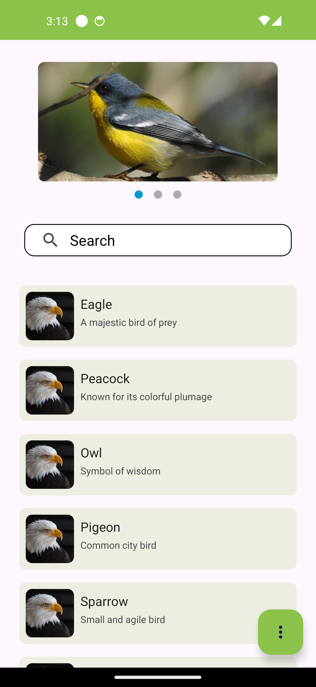

# EcoApp

Overview : 

Eco App is an Android application that displays a carousel of items with images and details. Users can search through these items and view detailed statistics about the content.

Features :

Carousel Display: Showcases a list of items in a carousel view with images and details.
Search Functionality: Allows users to search for items by name or other criteria.
Detailed Statistics: Provides insights into the items, such as the number of items per category and the most common characters in titles.
Responsive UI: Utilises ViewPager2 for smooth navigation and a BottomSheetDialogFragment for displaying statistics.

Usage :

Viewing the Carousel: Swipe left or right to navigate through the items in the carousel.
Searching: Use the search bar at the top to filter items based on your input.
Viewing Statistics: Click on the floating action button (FAB) to view statistics about the items displayed.

Architecture :

The app follows the MVVM (Model-View-ViewModel) architecture pattern, ensuring a clear separation of concerns and making the codebase more maintainable.

ViewModel: Manages the UI-related data and handles the business logic of the app.
Repository: Provides data to the ViewModel, either from a local source (mock data) or a remote source.
StateFlow: Observes changes in data and updates the UI accordingly.

Screenshots :
(Include screenshots to visually demonstrate the app's features.)

